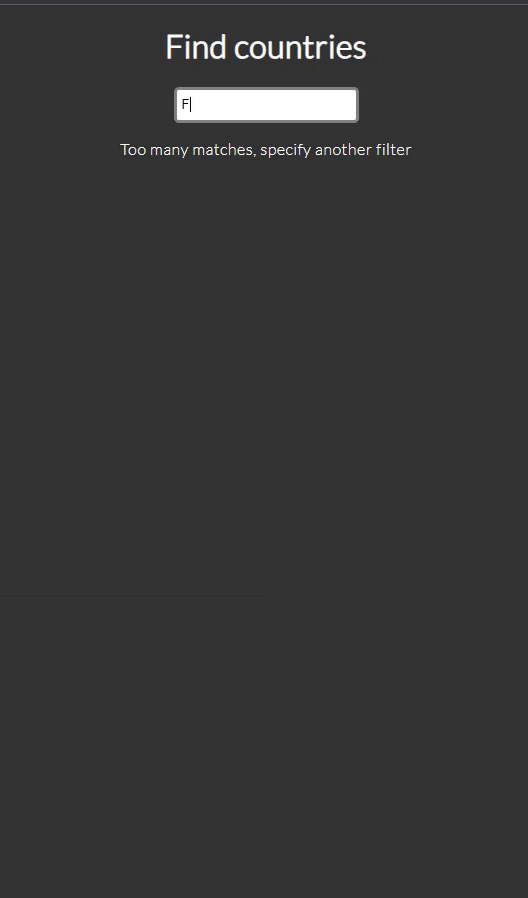

# Countries-Frontend

This repository contains the frontend codebase for the Countries React app that allows users to search for countries, retrieve information about them and view weather details. 

You can access the live version of the app [here](https://countries-backend-wjef.onrender.com/).

## Features

- Search and filter countries based on name.
- Display country information including name, capital, languages, flags, area and weather.

## Technologies used

- React: Frontend library for building user interfaces.
- Axios: Promise-based HTTP client for making API requests.
- REST Countries API: External API used to fetch country data.
- OpenWeatherMap API: External API used to fetch weather data.
